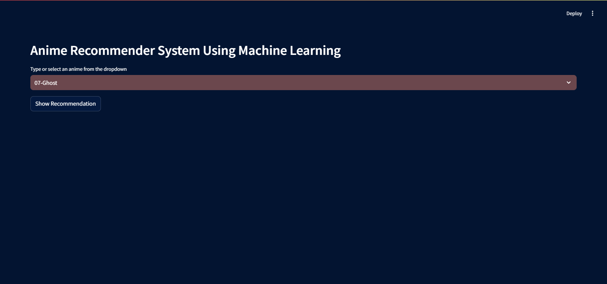
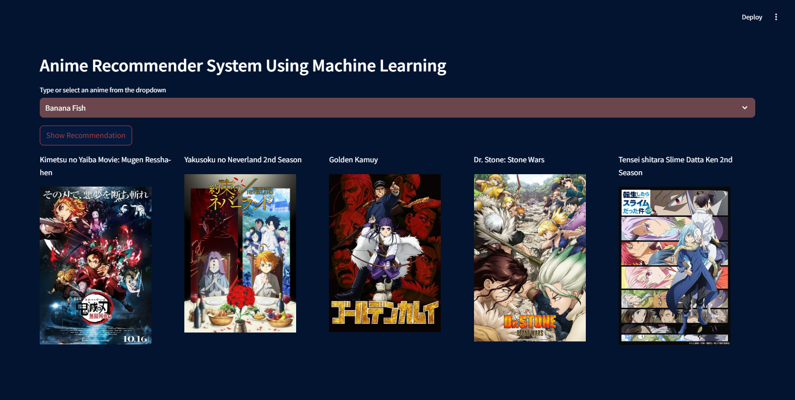
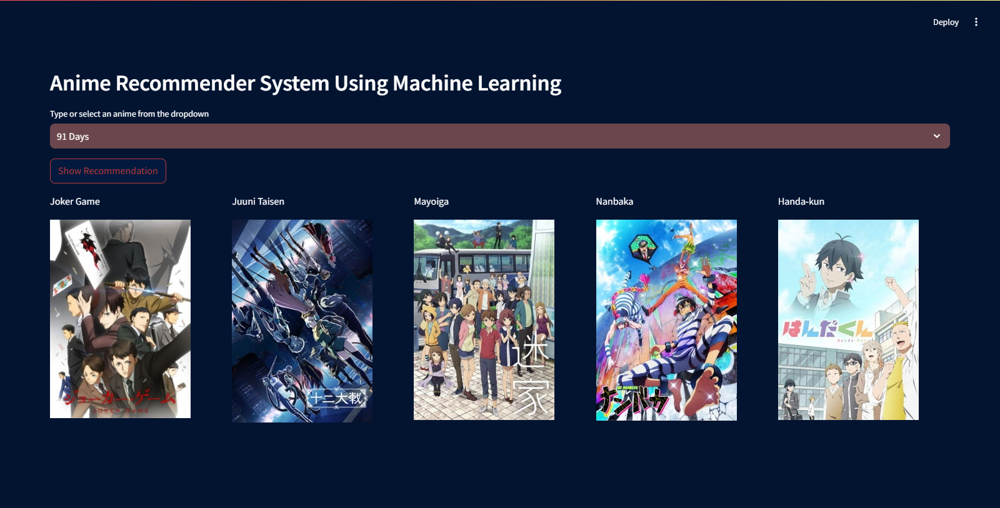

# **Anime Recommender System Using Machine Learning | Collaborative Filtering Based**

## Project Overview
An anime recommendation system using collaborative filtering based on user preferences and ratings. The system suggests anime based on the similarity of the user's behavior with other users.

## Types of Recommendation System

1. **Content-Based**
   - Recommends anime similar to the ones the user has shown interest in, based on features like genre, director, and description.

2. **Collaborative-Based**
   - Recommends anime based on user behavior, e.g., users who liked a specific anime are likely to like other anime that similar users have liked.

3. **Hybrid-Based**
   - Combines multiple recommendation approaches (e.g., collaborative and content-based) to improve recommendation accuracy.

## About the Project
This project implements an anime recommender system using collaborative filtering techniques. It uses the `NearestNeighbors` algorithm to suggest anime based on user preferences.

## Demo




## Dataset
The dataset used for this project includes information about anime, genres, directors, and user ratings. You can download the dataset from Kaggle using the following link:  
[MyAnimeList Dataset](https://www.kaggle.com/datasets/dbdmobile/myanimelist-dataset)

## Concept Used to Build the Model
- **NearestNeighbors**: This algorithm is used to find similar anime based on user preferences. The model predicts the most similar items for a given user based on collaborative filtering techniques.

## How to Run

### Step 1: Clone the repository
```bash
git clone https://github.com/yourusername/Anime-Recommender-System.git](https://github.com/Awaisa1i/Anime-Recommendation-Using-ML.git
cd Anime-Recommender-System
```
## Step 2: Activate the environment
```bash
conda activate my_env
```
### Step 3: Run the App
```bash
streamlit run app.py

